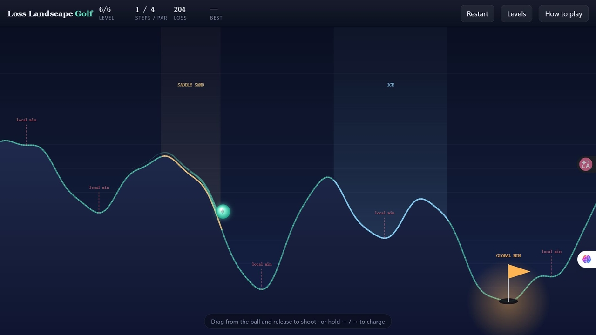
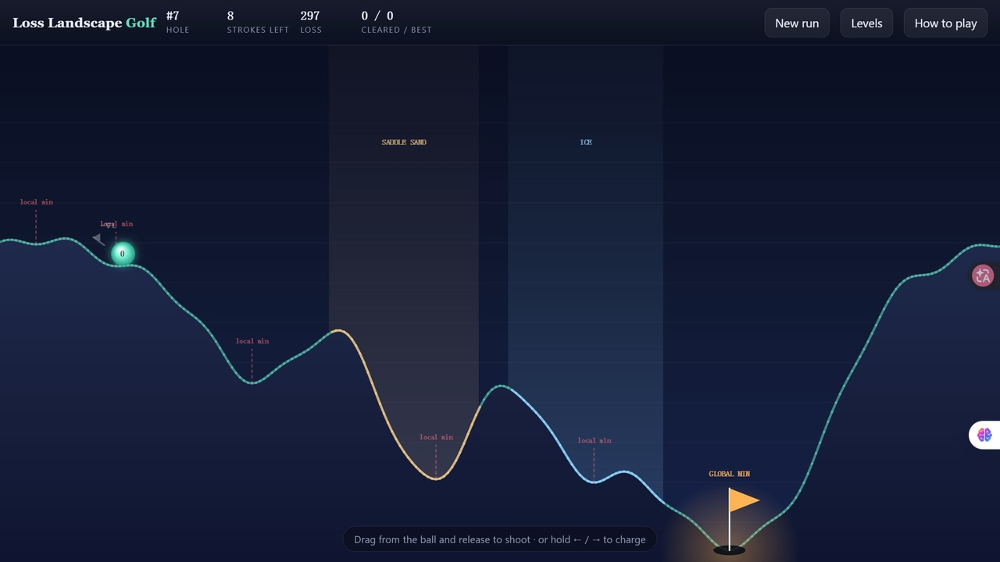

# Loss Landscape Golf

**You are the optimizer.** The curve is a loss function, the ball is your parameter. Sink it into the **global minimum** in as few steps as you can.

▶ **Play: https://tianqifu42.github.io/loss-landscape-golf/**

## Controls
- Drag away from the ball like a slingshot and release to shoot.
- Or hold `←` / `→` to charge and release. `R` restarts.
- Charge power *is* your **learning rate**: too small won't clear the ridge, too large overshoots the hole.

## Terrain
| Feature | Physics | What it feels like in training |
| --- | --- | --- |
| Local minimum | ordinary basin | Comfortable, but wrong — you need momentum to escape |
| Saddle sand | damping ×2.7, near-flat slope | Vanishing gradient: get stuck and you barely move |
| Ice | damping ×0.36 | Learning rate too high: the ball oscillates and won't settle |
| lr decay | damping ramps up after 2.4 s of rolling | Annealing, so every shot is guaranteed to converge |

## Modes
**Campaign** — six hand-built holes.
| # | Name | Par | Theme |
| --- | --- | --- | --- |
| 1 | Warm-up | 2 | feel the gradient |
| 2 | Local Minima | 3 | three basins, one answer |
| 3 | Saddle Sand | 3 | cross the flat plain |
| 4 | Ice Rink | 3 | learning rate too high |
| 5 | Noisy Gradients | 3 | tiny traps everywhere |
| 6 | The Boss | 4 | sand, ice, noise, decoys |

**Daily Hole** — one hole a day, the same one for everybody on the planet (the seed is the UTC date, so it flips at midnight UTC).

**Endless** — procedurally generated holes, forever. You start with 8 strokes; sinking a hole pays back `par − 1`, so par play breaks even and every miss drains the budget. Run out and the run ends. Score is holes cleared.
As the hole number climbs, decoy basins get deeper, gradient noise rises, sand and ice show up more often, and pars get tighter.

## Share card
When a run ends (or you finish the campaign) hit **Share result** to get a 1200×630 PNG with your score, the seed and the hole you died on — plus a one-click challenge link so others can replay your exact run!

## Deep links
- `#lv=3` jumps straight to campaign level 3
- `#daily` opens today's Daily Hole
- `#endless` starts a random endless run, `#endless=61109` replays a specific seed

## Technical notes
This is a zero-dependency front-end app built with HTML5 Canvas, raw vanilla ES6, and CSS. The math (splines, RK4 integration, damping, and deterministic noise) is computed in plain JavaScript. There are no game engines or physics libraries.

It uses standard localStorage to keep track of your campaign stars, completed levels, and endless high score.

## Deploying
If you fork this, it's ready for GitHub Pages:
1. Turn on GitHub Pages in repository Settings under the **Pages** tab.
2. Select **Deploy from a branch** and set build source to **main** / `/(root)`.
3. Your game will be live at `https://<username>.github.io/loss-landscape-golf/`.
